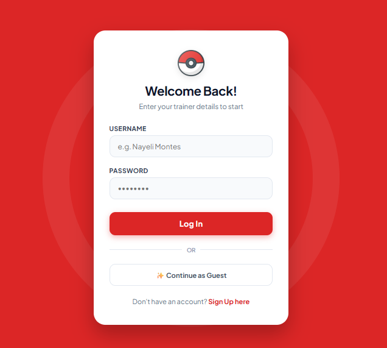
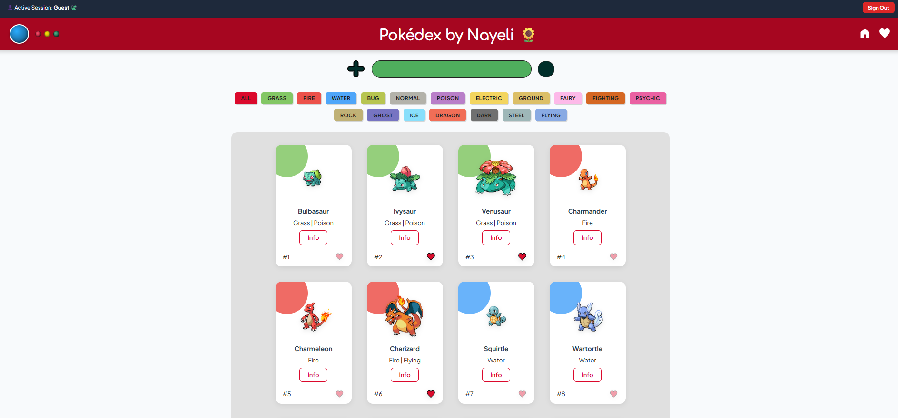

# Pokédex
<h4 align="center">
	
</h4>

## 💻 Sobre el proyecto

El proyecto consiste en el desarrollo de una página web responsiva que simule una Pokédex, utilizando la PokéAPI (https://pokeapi.co/) para manipular datos provenientes del servidor vía JSON, implementando scroll infinito y usando localStorage para almacenar datos. Adicionalmente, se desarrollará el backend de la página.

---

## 🎨 Layout

</i>
</i>

---

## 🛠 Tecnologías

- **[HTML](https://developer.mozilla.org/en-US/docs/Learn/Getting_started_with_the_web/HTML_basics)**
- **[CSS3](https://developer.mozilla.org/en-US/docs/Web/CSS)**
- **[JavaScript](https://developer.mozilla.org/en-US/docs/Web/JavaScript/Guide)**

# Base de Datos: Login System PHP and MYSQL for the project Pokédex by Nayeli
-- phpMyAdmin SQL Dump
-- version 4.9.0.1
-- https://www.phpmyadmin.net/
-- Host: 127.0.0.1
-- PHP Version: 7.3.9
--Database: `test_db`

#### **Utilitarios**

- Editor:  **[Visual Studio Code](https://code.visualstudio.com/)**
- Gravador: **[Open Broadcaster Software](https://obsproject.com/pt-br)**

---

## 📝 Contacto

Hecho por ❤️ Nayeli Montes 👋🏽 [Ponte en contacto!](https://www.linkedin.com/in/nayeli-montes/)

---
